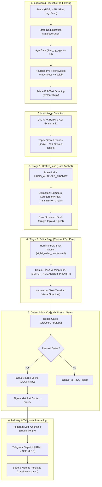

# ARCHITECTURAL AUDIT & SYSTEM DESIGN REVIEW
## Autonomous Financial Content Pipeline (LinkedIn / Institutional Audience)

**Document Version:** 2.0 (Post-Two-Stage Refactor)  
**Target Reviewers:** Principal AI Systems Architects, Senior NLP Engineers, LLM Alignment & Prompt Engineers (GPT-4o, Claude 3.5 Sonnet)  
**Repository:** `market-digest` (`newsbot`)  
**Evaluation Scope:** End-to-End Pipeline Architecture, Cognitive Decoupling (Drafter vs. Editor), Deterministic Safety Gates, Metric & Cadence Verification, Failure Modes & Edge-Case Resilience.

---

## 1. EXECUTIVE SUMMARY & SYSTEM OBJECTIVES

This system is an automated, production-grade intelligence and editorial engine operating in the intersection of financial journalism, macro analysis, and LinkedIn thought leadership. 

Unlike conventional "AI content generation" bots that churn out generic marketing summaries with emojis and synthetic enthusiasm, this pipeline enforces a rigorous editorial standard:
- **Audience:** Institutional investors, hedge fund analysts, private equity/venture capital partners, founders, and asset managers.
- **Author Persona:** A 22-year-old top-tier finance student and macro/equity practitioner speaking candidly to peers in a trading room or investment committee.
- **Core Philosophy:** Deep analytical substance (accounting mechanics, balance-sheet frictions, regulatory capital, contractual terms, transmission channels) delivered through **simple, punchy, spoken Anglo-Saxon syntax**.
- **Strict Anti-Personas:**
  1. *The 60-Year-Old Sell-Side Academic:* Banned from using 35-word bureaucratic sentences, Latinate filler, passive voice, or hollow meta-commentary ("Empirical tracking of corporate mortality reveals...").
  2. *The Cheap SMM Copywriter:* Banned from using emojis, bullet spam, rhetorical hype ("Game-changer!", "Double whammy!"), engagement bait ("Agree?", "Thoughts?"), and dramatic fake one-liners ("Here is the catch.").

The system ingests two distinct streams:
1. **Local CEE / Poland Pipeline (`src/main.py`):** Central European financial feeds, Polish regulatory/banking releases (KNF, NBP, GPW), macro indicators (HICP, bond auctions), and company disclosures.
2. **Global Macro Pipeline (`src/hugs_workflow.py`):** Curated institutional telegram intelligence (HugsFund), covering US sovereign debt dynamics, hyperscaler AI capex, global energy logistics, chokepoints, and cross-currency FX basis anomalies.

---

## 2. PIPELINE ARCHITECTURE (THE TWO-STAGE ENGINE)

The architecture is built on the principle of **Cognitive Decoupling**: separating *data extraction and causal reasoning* from *stylistic synthesis and human voice calibration*.



### Detailed Component Breakdown:

#### 1. Ingestion & Selection
- **Heuristic Prefiltering without LLM:** Given the daily quota limits of Gemini models (Free tier: 20 req/day per model; Pay-as-you-go safety buffers), the system must never feed raw unfiltered RSS feeds into an LLM. `heuristic_prefilter()` scores items using:
  $$\text{Score} = \text{weight} \times 2 + \text{TagBonus} + \text{Freshness} + \text{SocialBonus}$$
- **Full Text Enrichment:** Selected candidates are scraped via `src/enrich.py` (fetching raw article paragraphs) to provide ground truth for verification.

#### 2. Stage 1: Drafter Pass ("The Data Analyst")
- **Prompt:** `DRAFT_PROMPT` (in `src/brain.py`) or `HUGS_ANALYSIS_PROMPT` (in `src/hugs_workflow.py`).
- **Objective:** The Drafter is instructed to be an analytical excavator. It isolates the numerical divergence, balance-sheet anomaly, contractual obligation (e.g., Take-or-Pay compute agreements, Power Purchase Agreements), and downstream capital market impact (WACC, equity multiple de-rating, debt service coverage).
- **Why Drafter Does NOT Write the Final Output:** When an LLM is asked simultaneously to verify financial figures, structure logical transmission, conform to tight word counts, and adopt a nuanced natural human voice, cognitive thrashing occurs. The output typically collapses into either rigid bullet points or flowery AI clichés. The Drafter is purposely allowed to produce dense, clinical prose.

#### 3. Stage 2: Editor / Humanizer Pass ("The Cynical 22yo Peer")
- **Prompt:** `EDITOR_HUMANIZER_PROMPT` (in `src/brain.py` and `src/hugs_workflow.py`).
- **Temperature:** Strictly locked at `0.25` to prevent hallucinations, facts drifting, or number mutations while allowing stylistic rewording.
- **In-Context Learning:** Dynamically injects `style/golden_rewrites.md` into the prompt context.
- **Structural Blueprint (The Two-Part Structure):**
  - **Part 1 (Hook & Setup):** Immediate entry on the transaction or fact. Zero introductory throat-clearing.
  - **Part 2 (The Friction & Balance Sheet Risk):** Who holds the bag, why the model breaks, what happens when liquidity tightens.
  - **Part 3 / Terminal Line:** Concrete capital market verdict (credit spread widening, stock vs. bond divergence, de-rating).
- **Strict Word Limits:**
  - **Single Topic:** Exactly **100–120 words**.
  - **Multi-Topic Digest:** Exactly **110–130 words** (strictly 2–3 items with action headers).

#### 4. Stage 3: Deterministic Code Validation Gate (`src/score_draft.py`)
No LLM is trusted to grade its own output. A suite of fast, pure-Python deterministic validators audits the text prior to publication:
1. `check_truncation`: Verifies text ends in proper sentence-ending punctuation (`.`, `!`, `?"`). Prevents mid-sentence cutoff caused by token limits.
2. `check_length`: Splits by whitespace and enforces the hard boundaries (Single: 100–120, Digest: 110–130).
3. `check_anti_template_bleed`: Regex search for memorized phrases from few-shot examples (e.g., *"running into an insurance wall"*, *"if you want to see how the state governance discount works in real time"*).
4. `check_word_counter_leak`: Regex detection of parenthetical counters emitted by LLMs attempting to count words (e.g. `(75) (76)`).
5. `check_banned_words`: Scans for over 60 banned buzzwords, throat-clearing phrases, and telegraphic fragments.
6. `check_banned_openers`: Rejects meta-intros (`"What caught my eye..."`, `"Many investors assume..."`).
7. `check_has_number` & `check_number_format`: Enforces at least one verified numerical fact formatted in standard English notation (`5.2%`, `$42B`, `15.8 billion PLN`).

#### 5. Verification & Delivery
- `src/verify.py` conducts two-tier number verification:
  - **Level A (Local regex):** Searches for exact character representations of the claimed figures in the scraped source text or official NBP/GPW API cache.
  - **Level B (LLM Context Check):** Single call auditing whether numbers were transposed (e.g., annual vs. quarterly, base year).
- `src/deliver.py` partitions content safely under Telegram's 4096-character limit (targeting chunks of 3500 chars) using sentence-boundary and URL-aware splitting.

---

## 3. CORE PROMPTS & CONDITIONING SPECIFICATIONS

### 3.1 The Humanizer System Prompt (`EDITOR_HUMANIZER_PROMPT`)

```text
You are an expert financial editor refining LinkedIn drafts.
Author Persona: A 22-year-old top-tier finance student and macro/equity practitioner talking to peers in a room.
Audience: Institutional investors, hedge fund analysts, founders, and portfolio managers.

YOUR SOLE MISSION:
Rewrite the raw input draft into a readable, punchy, authentic human post. Eliminate all robotic stiffness, textbook bloat, and dense walls of text, while preserving 100% of the hard numbers and financial mechanics.

CRITICAL FORMATTING & READABILITY RULES:
1. TWO-PART STRUCTURE (NO MONOLITHS):
   - Every Single Topic post MUST be broken into 2–3 short, distinct paragraphs separated by blank lines.
   - Part 1 (Hook & Setup): The raw fact/transaction explained simply.
   - Part 2 (The Friction & Balance Sheet Risk): Who holds the bag, what breaks if assumptions fail.
   - Part 3 / Final Line: The capital market consequence (divergence, cost of capital, multiple compression).
   - Paragraphs must be 2–3 sentences max. Never produce a solid block of continuous text.

2. SIMPLE, CONVERSATIONAL VOCABULARY:
   - Explain advanced mechanics in plain English.
   - Ban 35-word academic run-on sentences. Alternate short punchy statements (3–6 words) with clear explanations.
   - NO scaffolding/announcements: ban "The logic is simple:", "The strategic play is clear:", "The mechanics are obvious:". Jump straight into the fact.
   - NO telegraphic fragments ("Fuel security is tight.", "Liquidity is drying up.", "The price: WIBOR...").

3. DIVERSIFY CLOSINGS (BAN THE ROBOTIC FORMULA):
   - Do NOT end every post with the formulaic "...forcing valuation multiple compression".
   - Vary the closing: contrast stock vs bond expectations, show who pays the bill, or state a blunt valuation calculation.

4. HARD WORD COUNT DISCIPLINE:
   - Single Topic: STRICTLY 100–120 words.
   - Digest: STRICTLY 110–130 words (strictly 2–3 bullets with action headers like "1. Buying your own customer:").
   - Every post MUST end with complete closing punctuation (. or !). Never cut off mid-thought.

OUTPUT FORMAT:
Return ONLY the final edited post text. No introductory remarks, no quotes, no word counts in brackets.
```

### 3.2 The Few-Shot Base (`style/golden_rewrites.md`)

The runtime context dynamically pairs the system prompt with 3 curated few-shot demonstrations:

```markdown
# GOLDEN REWRITES: FEW-SHOT EDITING EXAMPLES

---
## EXAMPLE 1: SINGLE TOPIC (Tech Capex & Vendor Financing)

[RAW INPUT DRAFT]:
Broadcom is underwriting its own demand by extending a massive $42 billion credit line to Anthropic... [Clinical, dense textbook draft]

[TARGET EDITED POST]:
Broadcom isn't just selling AI chips to Anthropic. It’s lending them the money to buy them.

Broadcom opened a $42 billion credit line to cover a third of Anthropic’s $125 billion TPU order. The mechanic is simple: Broadcom books massive silicon sales today, but takes all the customer credit risk directly onto its own balance sheet. If enterprise software monetization stalls, that loan doesn't vanish—Broadcom eats the write-down.

Credit desks already see the trap. Look at Oracle: surging debt insurance costs (CDS) prove that bondholders will not ignore heavy borrowing used to subsidize cloud hardware.

Stock investors are still chasing the sales headlines. Bond investors have already started pricing in the loan default risk.
```

### 3.3 Negative Lists vs. Positive In-Context Conditioning

Historically, the project accumulated over 100 banned words in negative prompt constraints (`style/banned_phrases.md`). However, LLM evaluation revealed clear diminishing returns:
1. **The "Don't Think of a Pink Elephant" Effect:** Negative constraints often increase token attention toward the banned concepts, leading models to either use synonyms that sound even more artificial or subtly leak the banned phrase.
2. **The In-Context Solution:** Replacing negative lists with **exact input $\to$ output transformations** (`[RAW INPUT DRAFT]` $\to$ `[TARGET EDITED POST]`) proved an order of magnitude more effective. The model replicates the structural pacing, syntax variation, and tone through attention without requiring exhaustive lexical policing.

---

## 4. SYSTEM EVOLUTION & SOLVED FAILURE MODES

The system's current maturity is the result of solving five severe production failure modes:

| # | Failure Mode | Root Cause in LLM Behavior | Architectural Solution Implemented |
| :--- | :--- | :--- | :--- |
| **1** | **Word Count Token Leakage Bug** | When instructed: *"Strictly 100–120 words. Count your words carefully"*, the LLM literally attempted to track word indices in the output: `market (75) rally (76) fueled (77)...` | 1. Prompt update: *"Calculate and verify word counts purely internally. Do not pollute the draft body with counters."*<br>2. Regex filter: `WORD_COUNTER_RE = re.compile(r"(?:(?:\b\w+\s*\(\d{1,3}\)\|\(\d{1,3}\)\s*\w+)[^\w]*\s*){3,}")` in `score_draft.py`. |
| **2** | **Template Bleed (Prompt Memorization)** | In-context few-shot examples contained striking hooks like *"AI data centers are running into an insurance wall"*. When asked to write about Polish bank taxes or European defense, the model reused: *"Polish banks are running into an insurance wall."* | 1. Anti-Leak prompt clause.<br>2. Deterministic regex gate `check_anti_template_bleed()` rejecting any draft containing exact signature phrases from the few-shot examples. |
| **3** | **Truncation Bug** | LLMs constrained by strict upper limits (e.g. max 120 words) frequently reached word 120 mid-thought and abruptly stopped: `...corporate debt servicing costs will` | `check_truncation()` gate requiring final characters to match sentence closers (`.`, `!`, `?"`). Truncated posts fail validation immediately and trigger retry/fallback. |
| **4** | **Extremes of Tone (Pendulum Effect)** | Single-pass generation oscillated wildly: either sound like an academic paper (dense, 35-word sentences) or degenerate into cheap LinkedIn clickbait with emojis and rhetorical questions. | **Two-Stage Decoupling:** Stage 1 (Drafter) focuses 100% on extraction accuracy and accounting logic; Stage 2 (Editor) focuses 100% on syntax pacing, paragraphing, and tone calibration at low temperature (0.25). |
| **5** | **Monolithic Walls of Text** | Models tended to output single solid blocks of 115 words. On mobile devices, this created high cognitive friction for readers. | 1. Prompting for **Two-Part Structure** with mandatory `\n\n` separation.<br>2. Unit tests enforcing that output consists of 2–4 visually distinct paragraphs. |

---

## 5. MECHANICAL AI CADENCE & BURSTINESS AUDIT

To ensure generated posts do not read like synthetic LLM prose, the project maintains an automated cadence auditing utility: `tools/ai_cadence_check.py`.

### Detection Dimensions:
1. **Category A (Antitheses):** Patterns like *"not X, but Y"*, *"it's not X. it's Y"*, *"Y, not X"*. Excessive antitheses are a primary hallmark of synthetic LLM writing.
2. **Category B (Single-Word Sentence Chains):** Rapid succession of 1-word dramatic sentences (*"Unprecedented. Relentless. Unsustainable."*).
3. **Category C (Clichés & Pathos):** Canned transitions (*"In today's world"*, *"The reality is"*, *"Game-changer"*, *"Double-edged sword"*).
4. **Category D (Bureaucratese & Corporate Connectors):** Overused Latinate words (*"Moreover"*, *"Furthermore"*, *"Delve"*, *"Leverage"*, *"Robust"*, *"Tapestry"*).
5. **Category E (Impersonal / SMM Hooks):** Lazy setups (*"Here's the thing"*, *"Here's the kicker"*, *"Let's break this down"*).
6. **Category F (Typographic Em-Dashes):** Flagging excessive `—` or `–` characters, which occur in LLM text at 10x the frequency of human professional writing.
7. **Category G (Parallel Pairs):** Syntactic parallelism (*"X did Y, and A did B"*).
8. **Burstiness Metric ($CV$):**
   $$\mu = \frac{1}{N}\sum_{i=1}^N L_i, \quad \sigma = \sqrt{\frac{1}{N}\sum_{i=1}^N (L_i - \mu)^2}, \quad CV = \frac{\sigma}{\mu}$$
   Human writing displays high sentence length variation ($CV > 0.40$), mixing 4-word punches with 20-word explanatory chains. Synthetic AI prose typically hovers around a monotonous $CV \approx 0.15 - 0.25$.

---

## 6. EXPLICIT AUDIT QUESTIONS FOR EXTERNAL LLM REVIEWERS (GPT-4o & CLAUDE 3.5 SONNET)

*Please analyze this architecture critically. Provide concrete, actionable, and adversarial feedback on the following questions:*

### Question 1: Single-Point-of-Failure & Pipeline Fragility
In the current sequential flow:
$$\text{Ingest} \longrightarrow \text{Rank} \longrightarrow \text{Enrich} \longrightarrow \text{Draft (Stage 1)} \longrightarrow \text{Edit (Stage 2)} \longrightarrow \text{Verify} \longrightarrow \text{Deliver}$$
If Stage 2 (Editor pass) fails or hallucinates an edit that fails `score_draft.py`, the system currently falls back to the unedited Stage 1 draft.
- *Does this fallback re-introduce the very stylistic stiffness we sought to eliminate?*
- *What is the optimal retry/mutation strategy when Stage 2 violates word limits by 2–3 words? Should we implement an automated token trimming pass or loop back to Stage 2 with targeted feedback?*

### Question 2: In-Context Learning Drift & Few-Shot Scaling
We currently condition the Editor on 3 curated examples in `golden_rewrites.md` at $T=0.25$.
- *Are 3 few-shot examples sufficient to anchor the 22-year-old student persona across wildly different subjects (e.g. Polish bank capital vs. Silicon Valley TPU debt)?*
- *Would a dynamic Few-Shot selector (retrieving the most relevant golden rewrite using vector cosine similarity or tag matching) significantly improve style adherence over a static prompt?*

### Question 3: Cognitive Decoupling vs. Single-Pass Prompting (Tokens & Latency)
The two-stage engine requires two sequential LLM calls (Stage 1 Drafter + Stage 2 Editor).
- *Given newer generation models (e.g., Claude 3.5 Sonnet, GPT-4o, Gemini 1.5 Pro/Flash), is two-stage generation still necessary, or can structured chain-of-thought (e.g., `<reasoning>`, `<draft>`, `<final_edit>`) within a single call achieve equivalent voice calibration without the latency and token overhead?*

### Question 4: Hallucination Surface in the Editor Pass
The Stage 2 Editor operates at $T=0.25$ with explicit instructions to preserve 100% of hard figures. However, when an LLM rephrases financial mechanisms to sound "conversational", subtle accounting errors can creep in (e.g. conflating *operating cash flow* with *EBITDA*, or *senior secured debt* with *subordinated Tier II capital*).
- *How can we deterministically guarantee that the Editor pass never mutates the underlying accounting mechanics, without writing hundreds of domain-specific regex rules?*
- *Is AST parsing or semantic entity diffing viable for micro-drafts of 100–120 words?*

### Question 5: Breaking the 9.5/10 Stylistic Ceiling
Even well-edited LLM copy often retains subtle statistical regularities (e.g., uniform paragraph lengths, predictable contrast placement).
- *What specific prompt constraints or decoding parameters (e.g., presence penalty, frequency penalty, min-p sampling) could eliminate the remaining synthetic markers?*
- *How can we reliably inject natural idiosyncrasy (e.g., parenthetical asides, asymmetrical paragraph lengths) without making the text erratic or unprofessional?*

### Question 6: Automated Evaluation & Humanization Benchmark Harness
Currently, unit tests verify word counts, punctuation, and banned phrases. However, measuring whether a draft actually sounds like a "cynical 22yo institutional practitioner" remains partly subjective.
- *What automated LLM-as-a-judge rubric or statistical scoring pipeline would you recommend to continuously benchmark draft quality on every CI run?*
- *Can our `tools/ai_cadence_check.py` be extended to provide a continuous 0–100 Human Authenticity Score?*

---

**End of Audit Specification.**  
*Please submit all review comments, architecture critique, and concrete code/prompt recommendations directly referencing the sections above.*
